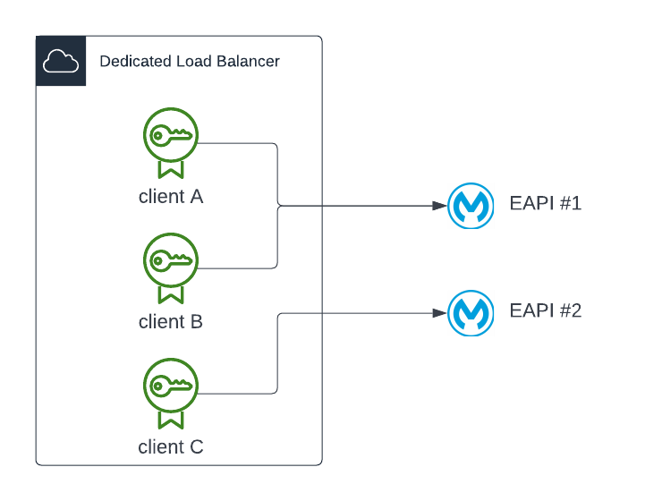
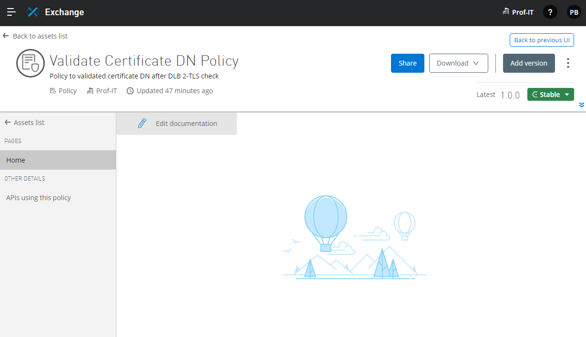
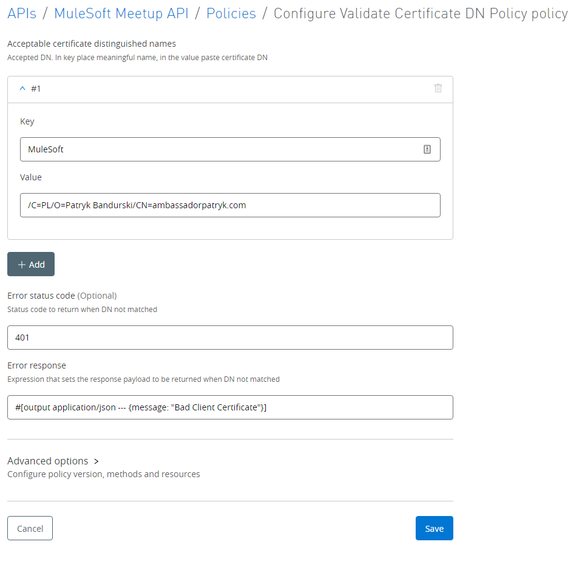
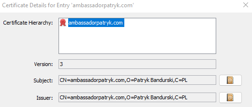

# Certificate DN Validation Policy

Custom policy to validate certificate DN (Distinguished Name) after two-way TLS check done by 
Dedicated Load Balancer. 

## Usage

Use this Custom Policy when you have a DLB and multiple client certificates used by multiple applications. By using
this policy ensures that API access is limited to only an acceptable subset of registered client certificates on DLB.

DLB depicted on the diagram below has three client certificated installed (client A, client B and client C). Without
extra configuration all APIs accessible via DLB will accept those three client certificates. In many cases this is a
security issue. Like on the diagram I would like to use client A and client B certificate only for EAPI #1 and client C
certificate only for EAPI #2.

In this case, on DLB, you need to set **Client Certificate Validation** to **Optional**. This means that the client certificate still
will be validated; however, the wrong certificate won't be stopped. The Custom Policy will do this.

## How it works?

1. DLB receives request
2. DLB checks the client certificate
3. DLB set **x-ssl-client-verify** header with validation outcome. Possible value are **SUCCESS**, **NONE**, **FAILED**
4. DLB set **x-ssl-client-dn** header with client certificate DN.
5. DLB calls API and reaches our Custom Policy
6. Policy check if **x-ssl-client-verify** is **SUCCESS** and only if it is true then checks if DN in header x-ssl-client-dn is one of registered DNs in Policy configuration
7. If both conditions are met, traffic is passed to the target API, otherwise error response is returned.

Headers x-ssl-client-verify, x-ssl-client-dn can't be overwritten. If the malicious user calls DLB with those headers 
they will be replaced by DLB (step 3 and 4).

## Installation

### Applying your organization

Go to **pom.xml** file and change 
- line 8: put your organization id / business group id that you would like to deploy custom policy
- line 20: put your organization id / business group id that you would like to deploy custom policy

### Maven Settings

Remember to have the MuleSoft EE server configured in **settings.xml** file. It is required to build the policy.

### Deployment

``mvn clean deploy``

Command will deploy the custom policy to Anypoint Exchange to the business group defined in previous steps. 
Like on the screenshot below.

## Policy Configuration

Go to API Manager, select the environment and API that you would like to apply the policy to, and click Add policy.

On the screenshot below, you can see sample configuration. We can configure 
- multiple DNS as key-value pairs
- error status code (optional)
- error response (optional)

### Acceptable certificate DNs

Key is a human-readable name of the client certificate like MuleSoft Test Team etc.
Value is a Distinguished Name. 

DLB sets the following DN ``/C=PL/O=Patryk Bandurski/CN=ambassadorpatryk.com`` for following certificate 

As you can see we need to add slashes for each field. 

### Error Status Code

Status code returned in case of the wrong client certificate. This field is optional. Default value is 401

### Error Response

Response returned in case of the wrong client certificate. This field is optional. Default response is 

``{
"message": "Bad Client Certificate"
}``